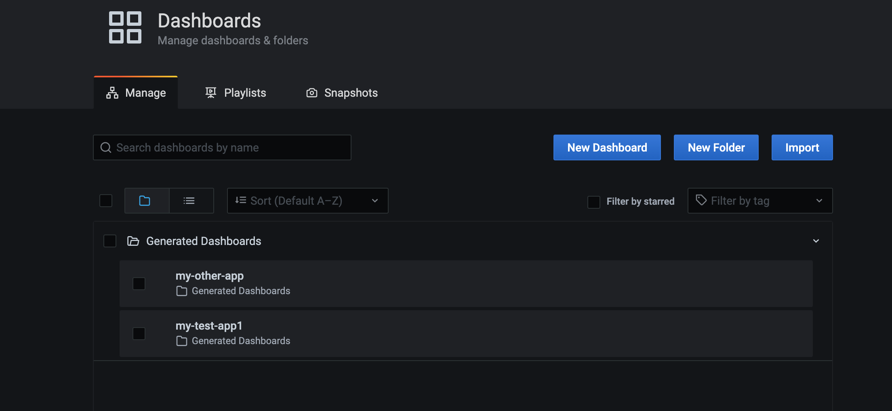

# grafana-tf-poc
POC for Grafana with Terraform provisioning

## Quick Start

- Do `docker-compose up` to start a local Grafana instance.  
- Login with `admin/admin` and create an API key with editor permissions.  
- Replace the authentication key in main.tf.
- Do `terraform apply` to apply the dashboard   

## generated-panel
A TF module to abstract the json template for a panel.  
Mulitple panel template could be created here. An example Random Walk template is used.  
[./tf/modules/generated-panel](./tf/modules/generated-panel)

## generated-dashboard
A TF module to abstract the json template to create a new Grafana dashboard.  
It takes a list variable of panel jsons to inject in the dasboard.  
[./tf/modules/generated-dashboard](./tf/modules/generated-dashboard)

## generated folder
For debugging, the generated json files are emitted here.  
[./tf/generated](./generated)

## Screenshots

Terraform  

Dashboards  
